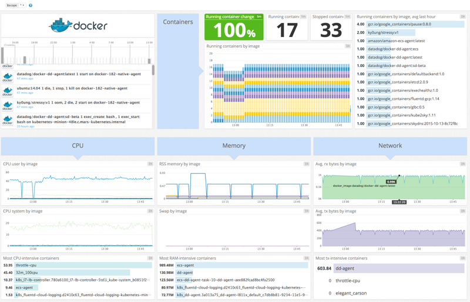

# DataDog 的 DCE 解决方案

## 解决方案介绍

Datadog 可以通过收集 Docker 的性能指标来可视化展示您的容器性能，并且可以看到APP的性能状态。

## 安装

在每一台DCE主机上面执行一个命令，就可以将主机接入 DataDog。[安装DataDog Agent](https://app.datadoghq.com/account/settings#agent/docker)

## 使用

打开DataDog控制台就可以看到DCE的监控信息了。

参考:

- [DataDog 集成 Docker](http://docs.datadoghq.com/integrations/docker/)